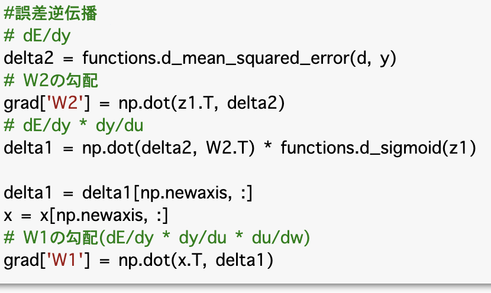

# ニューラルネットワークの全体像

* 深層学習で行おうとしていることは、明示的なプログラムの代わりに多数の中間層を持つニューラルネットワークを用いて、入力値から目的とする出力値に変換する数学モデルを構築すること

* ニューラルネットワークは最初の層を入力層、中間の層を中間層、最後の層を出力層と呼ぶ

* 入力層から中間層・中間層から出力層への伝達時は、重み$W$とバイアス$b$がかかり、最終的には最適な重みとバイアスを発見することが学習の目的となる

確認テスト
* ディープラーニングは、結局何をやろうとしているか2行以内で述べよ  
明示的なプログラムの代わりに多数の中間層を持つニューラルネットワークを用いて、入力値から目的とする出力値に変換する数学モデルを構築すること

* どの値の最適化が最終目的か  
重み、バイアス

# 1-1.　入力層〜中間層

* 入力層で受け取った情報$x$は、重み$W$とバイアス$b$によって以下の様に示される

$$
W=
\begin{pmatrix}
   w_{1} \\
   \vdots\\
   w_{l} 
\end{pmatrix}
$$

$$
x=
\begin{pmatrix}
   x_{1} \\
   \vdots\\
   x_{l} 
\end{pmatrix}
$$
$$
u=W^{T}x+\bm{b}
$$

# 1-2.活性化関数

* 活性化関数とは、ニューラルネットワークにおいて、次の層への出力の大きさを決める非線形の関数のこと

* 中間層用の活性化関数には、ステップ関数・シグモイド関数・ReLU関数等がある

* 出力層用の活性化関数には、ソフトマックス関数・恒等写像・シグモイド関数等がある

ステップ関数

$$
\begin{equation*}
f(x)
=
\begin{cases}
1　& \text{($x\geq0)$} \\
0  & \text{($x<0)$} 

\end{cases}
\end{equation*}
$$

シグモイド関数
$$
f(x)=\frac{1}{1+e^{-x}}
$$

ReLU関数
$$
\begin{equation*}
f(x)
=
\begin{cases}
x　& \text{($x>0)$} \\
0  & \text{($x\leq0)$} 

\end{cases}
\end{equation*}
$$

確認テスト
* 線形と非線形の違いを簡易に説明せよ  
線形な関数は加法性$（f(x+y)=f(x)+f(y)f(x+y)=f(x)+f(y)）$と斉次性$（f(kx)=kf(x)f(kx)=kf(x)）$を満たすが、非線形な関数は満たさない

# 1-3. 出力層

* 出力層の役割は、各クラスに分類される確率を出力すること

* 出力層用の活性化関数には、ソフトマックス関数・恒等写像・シグモイド関数等がある

ソフトマックス関数
$$
f(i,x)=\frac{e^{x_{i}}}{\sum^{K}_{k=1}e^{x_{k}}}
$$

恒等写像
$$
f(x)=x
$$
## 誤差関数

* 出力層より得られた学習結果と訓練データより得られる正解を、誤差関数を使って検証することで、ニューラルネットワークによりどの程度よい結果が得られたかを判断することができる

* 誤差関数には、二乗和誤差と交差エントロピー誤差が用いられる

### 二乗和誤差
$$
E_{n}(w)=\frac{1}{2}\sum^{I}_{i=1}(y_{n}-d_{n})^{2}
$$
### 交差エントロピー誤差

$$
E_{n}(w)=-\sum^{I}_{i=1}d_{i}\log y_{i}
$$

# 1-4. 勾配降下法

## 勾配降下法
$$
w^{(t+1)}=w^{(t)}-\varepsilon \nabla	E  \ （ただし、\varepsilon は学習率）
$$

$$
\nabla	E=\frac{\partial E}{\partial w}=(\frac{\partial E}{\partial w_{1}}\cdots \frac{\partial E}{\partial w_{M}})

$$

* 深層学習の目的は、学習を通して誤差を最小にするネットワークを作成すること.つまり、誤差を最小化するようなパラメータ見つけること.

* パラメータを最適化するための手法の一つが勾配降下法

* 学習率が大き過ぎると最小値にいつまでも辿りつかず発散する

* 学習率が小さすぎると収束するまでに時間がかかる

* 学習率の決定、収束性向上のためのアルゴリズムとしてMomentum,AdaGrad,RMSProp,Adam等がある

## 確率的勾配降下法

* ランダムに抽出したサンプルを用いて誤差を求める方法

* 勾配降下法と比較して、データが冗長な場合の計算コストの軽減、望まない局所極小解に収束するリスクの軽減、オンライン学習ができるなどのメリットがある

* オンライン学習は、学習データが入ってくるたびに都度パラメータを更新し、学習を進めていく方法

## ミニバッチ勾配降下法

* ミニバッチ勾配降下法は、オンライン学習の特徴をうまくバッチ学習で使えるようにした手法

* ランダムに分割したデータの集合（ミニバッチ）に属するサンプルの平均誤差

* 確率的勾配降下法のメリットを損なわず、計算機の計算資源を有効利用できる.つまり、CPUを利用したスレッド並列化やGPUを利用したSIMD並列化ができる

# 1-5. 誤差逆伝播法

* 誤差逆伝播法は、算出された誤差を出力層側から順に微分し、前の層へと伝播させる手法

* 最小限の計算で各パラメータにおける微分値を解析的に計算することができる

# 2-1.勾配消失問題

* 勾配消失問題は、誤差逆伝播が下位層に進んでいくにつれて、勾配がどんどん緩やかになっていき、下位層のパラメータがほとんど変わらず最適値に収束しなくなる問題のこと(勾配は偏微分で計算されるため下位層になるほど連鎖律が続くのでパラメータの更新量が非常に小さくなる)

## 勾配消失問題の対策

### 活性化関数の選択

#### シグモイド関数
大きな値では出力の変化が微小なため、勾配消失問題を引き起こしてしまう
#### ReLU関数
入力値が閾値0を超えている場合、入力値をそのまま出力するため勾配消失問題が起こりにくい
### 重みの初期値設定
重みの初期値を工夫することで、勾配消失を防ぐことができる
#### Xavier
重みの要素を、前の層のノード数の平方根で除算した値
(各層の出力結果が0か1に偏ることがないため、勾配が消失するリスクを低減する)
#### He
重みの要素を、前の層のノード数の平方根で除算した値に対して$\sqrt{２}$をかけた値

### バッチ正規化
ミニバッチ単位で入力値のデータの偏りを抑制する手法(活性化関数に値を渡す前後にバッチ正規化の処理を含む層を加える)

# 2-2.学習率最適化手法

## 学習率の決め方
* 初期は大きく設定し、学習が進むにつれて徐々に学習率を小さくする
* パラメータごとに学習率を可変させる
* 学習率最適化手法を使用する

### Momentum
誤差をパラメータで微分した値と学習率の積を減算(ここまでは、勾配降下法と同様)し、現在の重みに前回の重みを減算した値と慣性$\mu$の積を加算
$$
V_{t}=μV_{t−1}−\varepsilon \nabla	E
$$
$$
w^{(t+1)}=w^{(t)}+V_{t}
$$
### AdaGrad
誤差をパラメータで微分したものと再定義$\varepsilon \frac{1}{\sqrt{h_{t}}+\theta}\nabla	E$した学習率の積を減算する
$$
h_{0}=\theta \ (ただし、\thetaはゼロ除算を避けるための極めて小さな値(10^{12}など))
$$
$$
h_{t}=h_{t-1}+(\nabla	E^{2})
$$
$$
w^{(t+1)}=w^{(t)}-\varepsilon \frac{1}{\sqrt{h_{t}}+\theta}\nabla	E
$$
### RMSProp
AdaGradの問題を改良
$$
h_{t}=\alpha h_{t-1}+(1-\alpha)(\nabla	E^{2}) \ （ただし、\alphaは1より小さい値）
$$
$$
w^{(t+1)}=w^{(t)}-\varepsilon \frac{1}{\sqrt{h_{t}}+\theta}\nabla	E
$$

### Adam
MomentumとRMSpropを組み合わせたアルゴリズム

# 2-3. 過学習
* 過学習は、学習が訓練データに適合し過ぎてしまい、訓練誤差が減少しているのにも関わらず、テスト誤差が増加してしまう現象

## 過学習の対策手法

* 正則化手法（誤差に対して正則化項を加算することで重みを抑制すること）を利用して過学習を抑制する

* L1正則化（ラッソ回帰）はマンハッタン距離、L2正則化（リッジ回帰）はユークリッド距離を用いている

* ドロップアウトは、ランダムにノードを削除して学習させることで過学習を抑止する方法であり、データ量を変化させずに、異なるモデルを学習させていると解釈できる

# 2-4. CNN

* CNNとは画像の識別や処理を行う際によく用いられるネットワーク

## 畳み込み層

* 畳み込み演算を行い活性化関数を通す層

## プーリング層

* 対象領域の中から1つの値を取得する層

* 最大値プーリング•平均値プーリング等がある

# 2-5.最新のCNN

## AlexNetのモデル説明

* AlexNetとは2012年に開かれた画像認識コンペティション2位に大差をつけて優勝したモデル

* AlexNetの登場で、ディープラーニングが大きく注目を集めた

* LeNetが世に出てから20年近くが経過して、AlexNetが発表された

* AlexNetは、5層の畳み込み層およびプーリング層、それに続いて2層の全結合層を用いた構造となっている

* 活性化関数にRelu関数・LRNという局所的正規化を行う層・ドロップアウトを用いる点がLeNetとの違い

