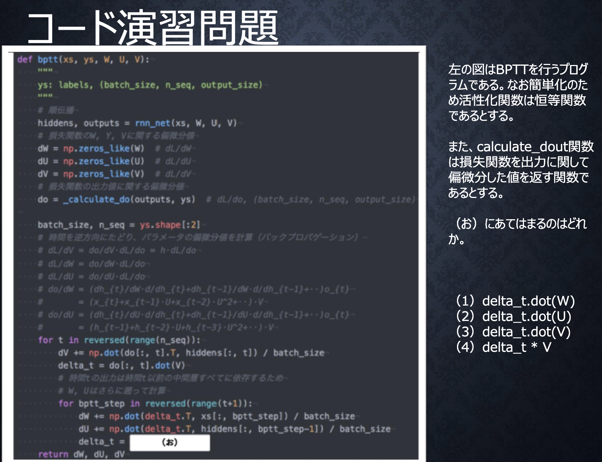

# 3-1.再起型ニューラルネットワークの概念

## RNN
$$
u^{t}=W_{(in)}x^{t}+Wz^{t-1}+b
$$
$$
z^{t}=f(u^{t})
$$
$$
v^{t}=W_{(out)}z^{t}+c
$$
$$
y^{t}=g(v^{t})
$$

時系列データに対応可能な、ニューラルネットワーク.過去の中間層の出力を参照することで時系列データに対して、より高い性能を得ることができる.

確認テスト  
* サイズ5×5の入力画像を、サイズ3×3のフィルタで畳み込んだ時の出力画像のサイズを答えよ。なおストライドは2、パディングは1とする。  

3 $\times$ 3  

確認テスト  
* RNNのネットワークには大きくわけて3つの重みがある。1つは入力から現在の中間層を定義する際にかけられる重み、1つは中間層から出力を定義する際にかけられる重みである。残り1つの重みについて説明せよ。

中間層から中間層への重み

## 時系列データ
時間的順序を追って一定間隔ごとに観察され，かつ、相互に統計的依存関係が認められるようなデータの系列（Ex.音声・言語・動画像等）

## BPTT(Backpropagation Through Time)
RNNにおけるパラメータ調整方法であり、RNNにおける逆誤差伝播法を指す.  
確認テスト  
* 連鎖律の原理を使い、dz/dxを求めよ。
$$
z=t^{2},t=x+y
$$
$$
\frac{dz}{dx}=\frac{dz}{dt}\frac{dt}{dx}=2t=2(x+y)
$$
  

2
# 3-2.LSTM
RNNでは時系列を過去に遡るほど勾配が消失する.活性化関数や重み等の初期化の手法を変えることも抑制する方法の1つだが、LSTMは、ニューラルネットワークの構造を変えて解決したもの.
## CEC
## 入力ゲートと出力ゲート
## 忘却ゲート
## 覗き穴結合

# 3-3.GRU
LSTMはパラメータが多く、計算負荷が高くなる問題があった.そこで、GRUでは構造を変えることでパラメータを削減し、タスクによっては精度も同様またはそれ以上を望めるようになった.つまり、LSTMを簡易化したもの.

# 3-4.双方向RNN
通常のRNNは過去の情報を保持することで時系列データの学習を実現していたが、双方向RNNは過去の情報に加えて未来の情報も加味させるモデル.
# 3-5.Seq2Seq
RNNを用いたEncoder-Decoderモデルの1つ.機械対話や機械翻訳等で用いられている。
# 3-6.Word2vec
分布仮説から単語を固定長のベクトル化(単語分散表現ベクトル)する手法.学習データからボキャブラリーを作成し、各単語をone-hotベクトルにして入力して単語分散表現を得る.

# 3-7.Attention Mechanism
Seq2Seqは文章の単語数に関わらず常に固定次元ベクトルで入力しなければならないため、長い文章への対応が難しい.そして、デコーダの入力はエンコーダの最後の状態を入力とするため最初の方の情報がうまく埋め込まれない.入力と出力のどの単語が関連しているか関連度を学習する仕組みがAttentionMechanism.

# 4-1.強化学習
* 強化学習とは、エージェントが長期的に報酬を最大化できる様に、環境の状況に合わせて行動を選択し、その行動によって環境が変化(報酬をエージェントに与える)するもの

* Ex.AlphaZero•自動車の自動運転等

# 4-2.AlphaGo
AlphaGoの学習は以下のステップで行われる
1. 教師あり学習によるRollOutPolicyとPolicyNetの学習
2. 強化学習によるPolicyNetの学習
3. 強化学習によるValueNetの学習

## PolicyNet（教師あり学習）
KGSの棋譜データから3000万局面分の訓練データを用意し、学習を行った.
具体的には、対局者が着手した手を1、残りを0とした19×19次元の配列を訓練データとし、それを分類問題として学習した.
この学習で作成したPolicyNetは57%ほどの精度である.

## ValueNet（強化学習）
現状のPolicyNetとPolicyPoolからランダムに選択されたPolicyNetと対局シミュレーションを行い、その結果を用いて方策勾配法で学習を行った.
PolicyPoolとは、PolicyNetの強化学習の過程を500Iteraionごとに記録し保存したものである.
現状のPolicyNet同士の対局ではなく、PolicyPoolに保存されているものとの対局を使用する理由は、過学習を防ぐ為.
この学習をminibatch size 128で1万回行った.

## AlphaGoとAlphaGoZeroの違い
* 教師あり学習を一切行わず、強化学習のみで作成した
* 特徴入力を石の配置のみにした
* PolicyNetとValueNetを１つのネットワークに統合した→デュアルネットワーク
* Residual Netを導入した
* モンテカルロ木探索からRollOutをなくした

# 4-3.高速化・軽量化技術
## 分散深層学習
分散深層学習とは、複数の計算資源（ワーカー）を使用し、並列的にニューラルネットを構築することで、効率の良い学習を行うことを指す.(深層学習は膨大なデータやパラメータ調整に多くの時間を要する為)
## 高速化
モデルが大きい時はモデル並列化を、データが大きい時はデータ並列化をすると良い.
### データ並列化
親モデルを各ワーカーに子モデルとしてコピーし、データを分割し、各ワーカーごとに計算させる.
### モデル並列化
親モデルを各ワーカーに分割し、それぞれのモデルを学習させる.全てのデータで学習が終わった後で、一つのモデルに復元する.

### GPU
CPUと違って、並列計算（特定の処理をいくつかの独立した小さな処理に細分化し、複数の処理装置上でそれぞれの処理を同時に行うこと）が得意.ニューラルネットの学習は単純な行列演算が多いので、高速化できる.
### GPGPU (General-purpose on GPU)
元々の使用目的であるグラフィック以外の用途で用いられるGPUの総称.

## 軽量化
### 量子化
重みの精度を下げることにより計算の高速化と省メモリ化を行う技術.

### 蒸留
複雑で精度の良い教師モデルから軽量な生徒モデルを効率よく学習を行う技術.

### プルーニング
寄与の少ないニューロンをモデルから削減し、高速化と省メモリ化を行う技術.

# 4-4.応用モデル

## MobileNet
* AlexNet以降、より深く・より複雑なCNNを構築することで精度を改善して来たが、計算量が増えることでコストがかかるデメリットがある
* MobileNetは、軽量で高速なCNN
* MobileNetはDepthwise ConvolutionとPointwise Convolutionの組み合わせで軽量化を実現

## DenseNet
* DenseNet(Dense Convolutional Network）は、CNNの一種.ResNetを改良したもの

* 全ての特徴量サイズが同じレイヤーを結合させて、スキップ接続を用いたもの

# 4-5.Transformer
* TransformerはRNNやCNNを使用せず、Attentionのみを用いるSeq2Seqモデル

* 主に自然言語処理 （NLP）の分野で使用される

* 時系列データを逐次処理する必要がない為、並列化が可能になり、訓練時間が短縮される

# 4-6.物体検知・セグメンテーション

* 物体検知とは、画像中から物体の位置の特定も含めてクラス分類を行う手法
* Ex.カメラの顔検出・自動運転の歩行者検知等
* セグメンテーションとは、画像に対してピクセルレベルでクラス分類を行う手法
* Ex.自動運転においての物体判別等
