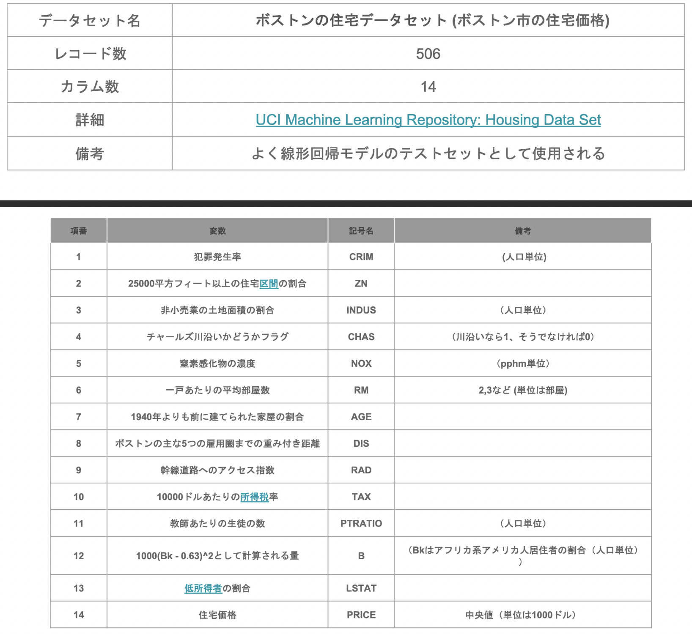
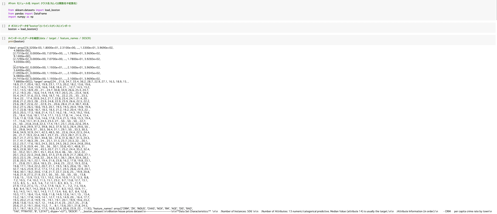
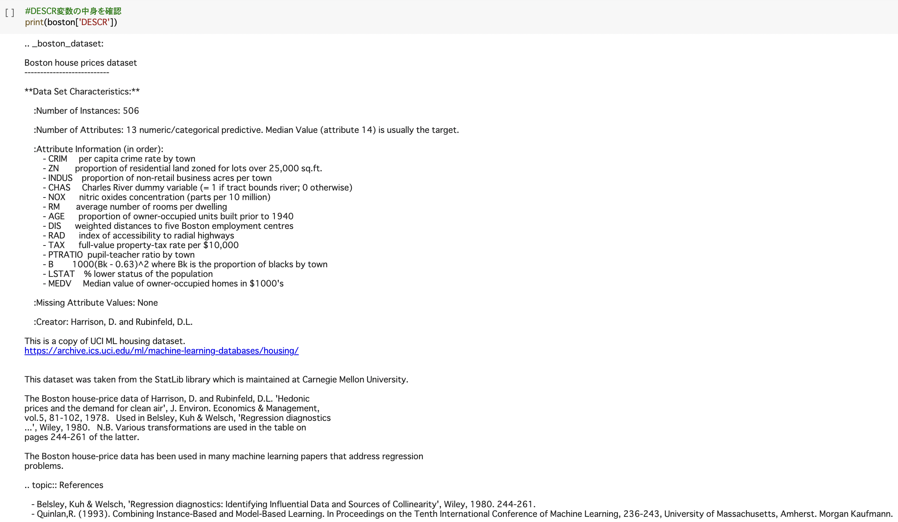
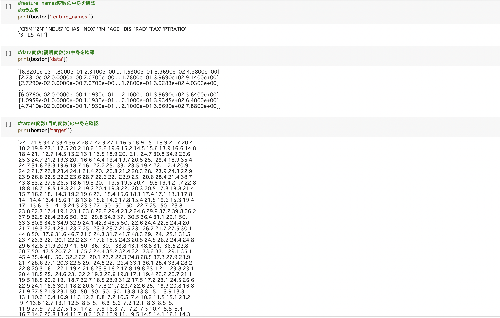
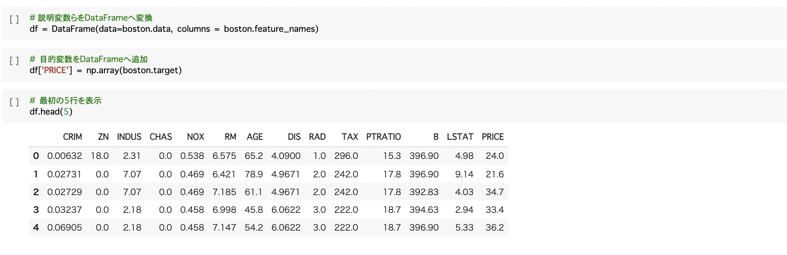
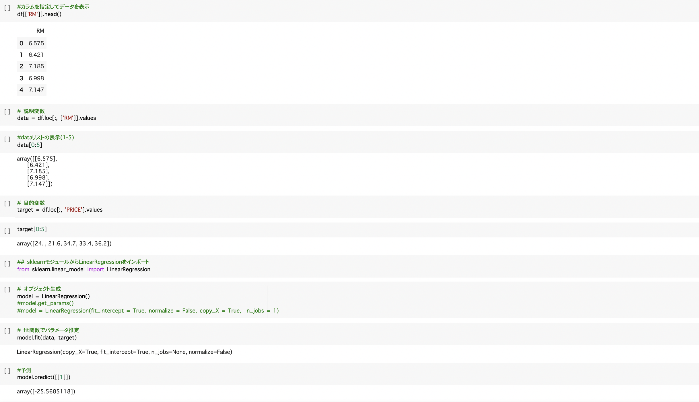
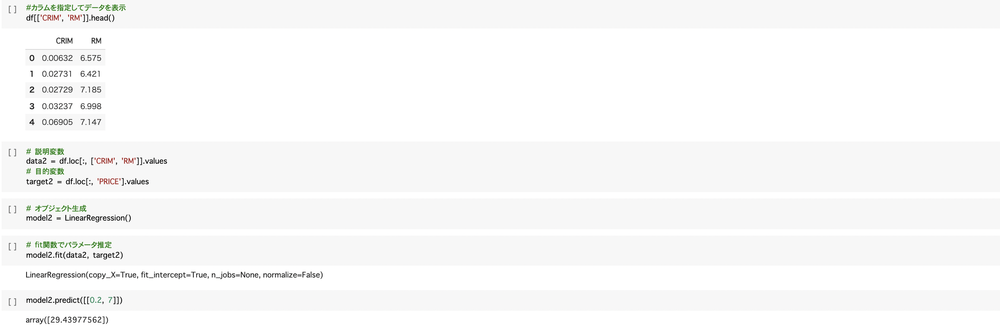
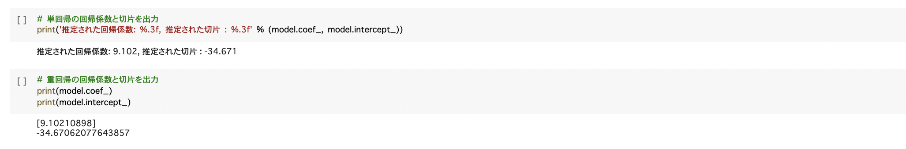
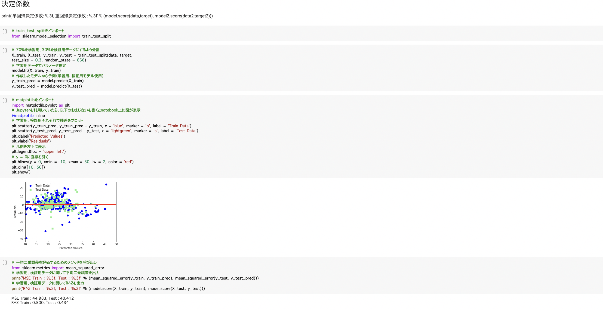

# 機械学習

## 機械学習の定義
コンピュータプログラムは、タスクT(アプリケーションにさせたいこと)を性能指標Pで測定し、その性能が経験E(データ)により改善される場合、タスクTおよび性能指標Pに関して経験Eから学習すると言われている(トム・ミッチェル(1997))

## 機械学習モデリングプロセス

問題設定→データ選定→データの前処理→機械学習のモデル選定→モデルの学習→モデルの評価
### 問題設定
課題を解決する際に必ずしも機械学習を用いる必要は無い.課題に沿った手法を使用すること.(課題が解決出来るなら、ルールベースでも良い)
### データ選定
gigo→ゴミを入れればゴミが出てくる.バイアスがかかったデータを使用しないこと.
### データの前処理
欠損、入力ミス、外れ値等の処理の事.機械学習モデリングプロセスにおいて、大半がデータの前処理に時間が割かれる.
### 機械学習のモデル選定
線形回帰、ロジスティック回帰、サポートベクターマシーン（SVM）、主成分分析（PCA）、k-means、K近傍法(knn)、深層学習等

### モデルの学習（パラメータ推定）
パラメータを決める.様々な手法がある.
### モデルの評価
ハイパーパラメータの選定.モデルの精度を図る.

# 線形回帰（理論）
$y$:目的変数（ハットは予測値を示す）、$\bm{w}$:パラメータ、$\bm{x}$:特徴量または説明変数、$w_{0}$:切片、m:パラメータと説明変数の次元数とした時、

$$
\hat{y}=\bm{w}^{T}\bm{x}+w_{0}=\Sigma^{m}_{j=1} w_{j}x_{j}+w_{0}
$$
これを**線形回帰**という.
## 平均二乗誤差

$$
MSE_{train}=\frac{1}{n}\Sigma^{n}_{i=1}(\hat{y}_{i}-y_{i})^{2} \ （ただし、n:訓練データ数）
$$
**平均二乗誤差**という.
## 最小二乗法
回帰においてパラメータの推定には、**最小二乗法**が用いられる.学習データの平均二乗誤差を最小とするパラメータを推定することを**最小二乗法**という.

$$
\bm{\hat{w}}=\underset{\bm{w}\in\mathbb{R}^{m+1}}{arg\ min} \ MSE_{train} 
$$
つまり以下を求めれば良い.

$$
\frac{\partial}{\partial \bm{w}}MSE_{train}=0
$$

求めると以下の様になる.

$$
\bm{\hat{w}}=(X^{(train)T}X^{(train)})^{-1}X^{(train)T}\bm{y}^{train}
$$
$$
\bm{\hat{y}}=X(X^{(train)T}X^{(train)})^{-1}X^{(train)T}\bm{y}^{train}
$$

## Tips
* 回帰はランキング問題も解けるがおすすめしない.（バプニックの原理)
* 誤差が大きすぎる時、別の説明変数の要素があるのではないかと考えることが大切.（誤差に吸収されている可能性がある）
* 二乗損失は一般に、外れ値に弱い.

# 線形回帰（実装）
今回はScikit-learnを用いる.
## 今回用いるデータ詳細

## 設定
ボストンの住宅データセットを線形回帰モデルで分析.

## 課題
部屋数が4で犯罪率が0.3の物件の場合の住宅価格の予測.

## 実装手順
### 1. モジュールとデータのインポート

'data'13個の特徴量、'target' 目的変数(住宅価格)、'featurename'(特徴量の変数名)

DESCR→description（説明）の略

それぞれ、'data'13個の特徴量、'target' 目的変数(住宅価格)、'featurename'(特徴量の変数名)の確認
※ここで外れ値が無いか確認すること(今回の場合'target'住宅価格なのでマイナスが無いか等)

### 2. データフレームの作成

データフレームを用いることでデータが見やすくなる.

### 3. 線形回帰分析

#### 線形単回帰

線形単回帰の部屋数1場合、予測が-25.5685118と出力された.※外挿問題:今回6~7部屋のデータを扱っている為、1部屋など上手く予測できない.

#### 線形重回帰(2変数)

犯罪率0.2、部屋数7の場合、予測が29.43977562と出力された.

犯罪率0.9、部屋数7の場合、予測が29.25433635と出力された.

犯罪率0.2、部屋数6の場合、予測が21.04870738]と出力された.

つまり、犯罪率が上がるまたは部屋数が減ると住宅価格が下がるとことがわかる.そして、このモデルは犯罪率よりも部屋数の方が住宅価格に影響を与えると考えていることがわかる.

### 4. 回帰係数と切片の値を確認

### 5. モデルの検証

予測値と実際の値の残差をプロット.

平均二乗誤差、決定係数は以下のようになった.

MSE Train : 44.983, Test : 40.412

R^2 Train : 0.500, Test : 0.434

