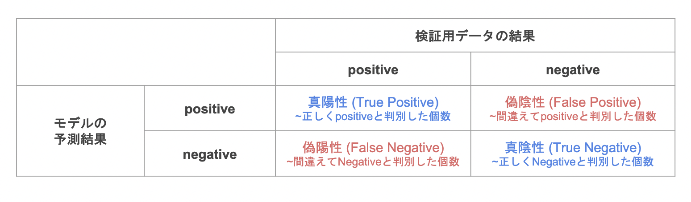

# ロジスティック回帰モデル
教師あり学習の二値分類における数理モデル.
# ロジスティック回帰（理論）
## ロジスティック回帰における準備

説明変数
$$
\bm{x}=(x_{1},x_{2},\cdots,x_{m})^{T}\in \mathbb{R}^{m}
$$
目的変数
$$
y\in \{0,1\}
$$
訓練データ
$$
\{(\bm{x}_{i},y_{i});i=1,2,\cdots,n\}
$$
パラメータ
$$
\bm{w}=(w_{1},w_{2},\cdots,w_{m})^{T}\in \mathbb{R}^{m}
$$
シグモイド関数
$$
\sigma(x)=\frac{1}{1+exp(-x)}
$$
シグモイド関数微分

シグモイド関数は連鎖率を用いて以下のように微分できる.
$$
\frac{\partial{\sigma(x)}}{\partial{x}}=\sigma(x)(1-\sigma(x))
$$
つまり、シグモイド関数は微分してもシグモイド関数を用いて表すことができる.尤度関数の微分を行う際にこれを利用すると計算が容易となる.

## ロジスティック回帰
ロジスティック回帰は以下の様に示される.
$$
P(Y=1|\bm{x})=\sigma(\bm{w}^{T}\bm{x}+w_{0})
$$

## 最尤推定
ロジスティック回帰モデルでは、ベルヌーイ分布を用いる.
### 尤度関数
$y_{1}\cdots,y_{n}$のデータが得られた際の尤度関数は以下の様に示される.
$$
P(y_{1},y_{2},\cdots,y_{n};p)
=\Pi^{n}_{i=1} p^{y_{i}}(a-p)^{1-y_{i}}
$$
尤度関数を最大化するようなパラメータを選ぶ推定方法を**最尤推定**という.
## ロジスティック回帰モデルの最尤推定
ロジスティック回帰モデルにおける最尤推定は以下の様に定義できる.

$$
\begin{equation*}
\begin{split}
P(y_{1},y_{2},\cdots,y_{n}|w_{0},w_{1},\cdots,w_{m})
&=\Pi^{n}_{i=1}\ p_{i}^{y_{i}}(1-p_{i})^{1-y_{i}}\\
&=\Pi^{n}_{i=1}\ \sigma(\bm{w}^{T}\bm{x_{i}})^{u_{i}}(1-\sigma(\bm{w}^{T}\bm{x_{i}}))^{1-y_{i}}\\
&=L(\bm{w})
\end{split}
\end{equation*}
$$
ここで、尤度関数Eを最大とするパラメータを探索する.(対数を用いると微分の計算が容易になる.)
$$
\begin{equation*}
\begin{split}
E(w_{0},w_{1},\cdots,w_{m})
&=-\log L(w_{0},w_{1},\cdots,w_{m})\\
&=\Sigma^{n}_{i=1}\{y_{i}\log p_{i}+(1-y_{i})\log(1-p_{i})\}
\end{split}
\end{equation*}
$$

## 分類における評価方法
### 混同行列
各検証データに対するモデルの予測結果を4つの観点(表)で分類し、それぞれに当てはまる予測結果の個数をまとめた表を**混同行列**という.

### 正解率
正解率は以下の様に表される.
$$
\frac{TP+TN}{TP+FN+FP+TN}
$$
### 再現率
再現率は以下の様に表される.
$$
\frac{TP}{TP+FN}
$$

### 適合率
適合率は以下の様に表される.
$$
\frac{TP}{TP+FP}
$$

### F値
F値は以下の様に表される.
$$
\frac{2再現率\cdot適合率}{再現率\cdot 適合率}
$$
# ロジスティック回帰（実装）