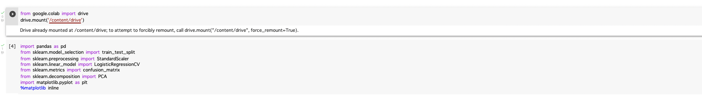
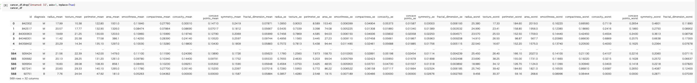
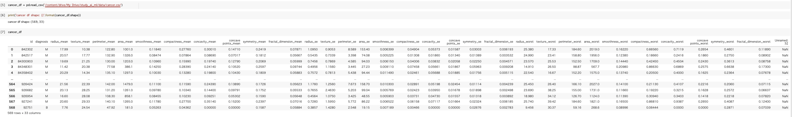
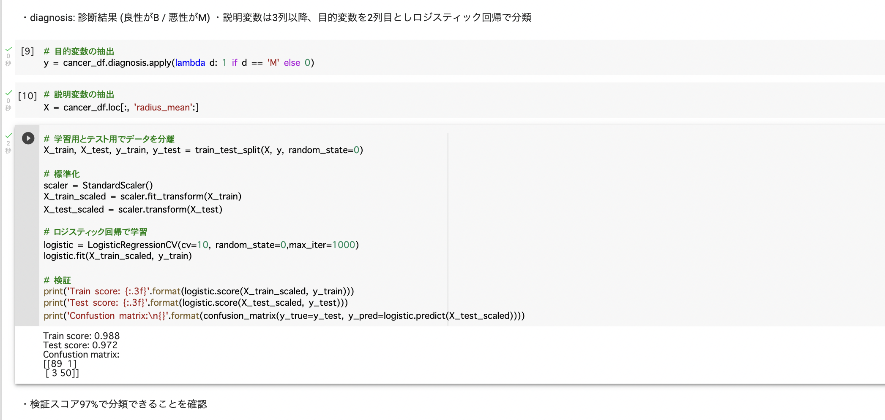
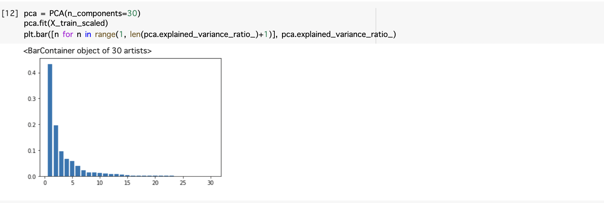
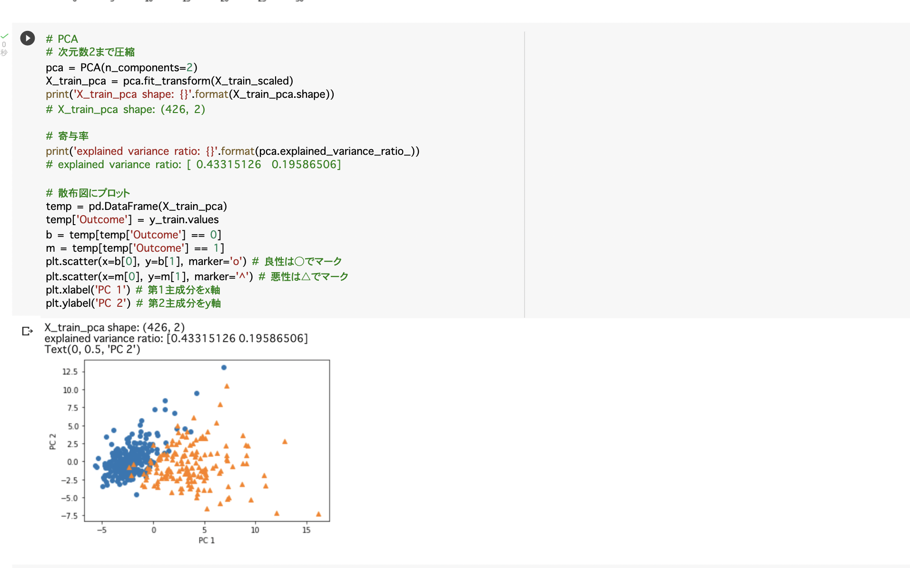

# 主成分分析
教師なし学習の次元削減における数理モデルの一つ.
# 主成分分析（理論）
学習データ
$$
\bm{x}_{i}=(x_{i1},x_{i2},\cdots,x_{im})\in \mathbb{R}^{m}
$$
平均（ベクトル）
$$
\hat{x}=\frac{1}{n}\sum^{n}_{i=1}\bm{x}_{i}
$$
データ行列
$$

$$
線形変換後のベクトル
$$
\bm{s}_{j}=(s_{1j},\cdots,s_{nj})^{T}=\bar{X}\bm{a}_{j} \ \bm{a}_{j} \in \mathbb{R}^{m}
$$
係数ベクトルが変われば線形変換後の値が変化する.

線形変換後の分散
$$
Var(\bm{s}_{j})=\frac{1}{n}\bm{s}_{j}^{T}\bm{s}_{j}=\frac{1}{n}(\bar{X}\bm{a}_{j})^{T}(\bar{X}\bm{a}_{j})=\frac{1}{n}\bm{a}_{j}^{T}\bar{X}\bar{X}\bm{a}_{j}=\bm{a}_{j}^{T}Var(\bar{X})\bm{a}_{j}
$$

# 主成分分析（実装）
### googledriveマウントとインポート

### データ読み込み

### 不要なデータを削除

### ロジスティック回帰モデルで検証
$$
logistic = LogisticRegressionCV(cv=10, random_state=0,max_iter=1000)
$$
最大反復回数max_iter=1000の指定が必要だった.

### 30次元の際の主成分分析

### 30次元を2次元まで圧縮した場合
