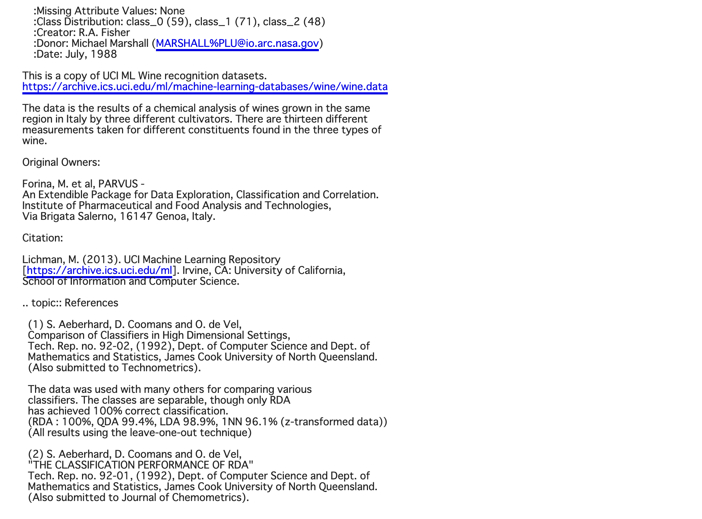

# kNN・k-means
# kNN（理論）
教師あり学習の分類における数理モデルの一つ.
最近傍のデータを$k$個取得してそれらのうち最も多くのデータが所属するクラスに分類する.（$k$を大きくすると決定境界は滑らかになる）

# kNN（実装）
### 1. モジュールをインポート

### 2. 乱数でデータ作成

### 3. 距離の計算・データ予測・結果に対する関数を作成

### 4-1. numpyを用いてkNN法で検証データを分類し、予測結果をプロット

### 4-2. sklearnを用いてkNN法で検証データを分類し、予測結果をプロット

# k-means（理論）
教師なし学習のクラスタリングにおける数理モデルの一つ.

アルゴリズム
1. 各クラスタ中心の初期値を設定する.
2. 各データ点に対して、各クラスタ中心との距離を計算し、最も距離が近いクラスタを割り当てる.
3.  各クラスタの平均ベクトル（中心）を計算する.
4.  収束するまで2, 3の処理を繰り返す.

問題点
* 各クラスタの中心の初期値が近いとうまくクラスタリングできない場合がある.(最近では、k-means++等が用いられている.) 
# k-means（実装）
ワインデータセットを用いてk-meansによるクラスタリングを行う.

### 1. モジュール・ワインデータのインポート

### 2. ワインデータセットの確認

### 3. 各次元ごとの要素数確認

### 4. データフレームを用いてクラスタリング結果表示

